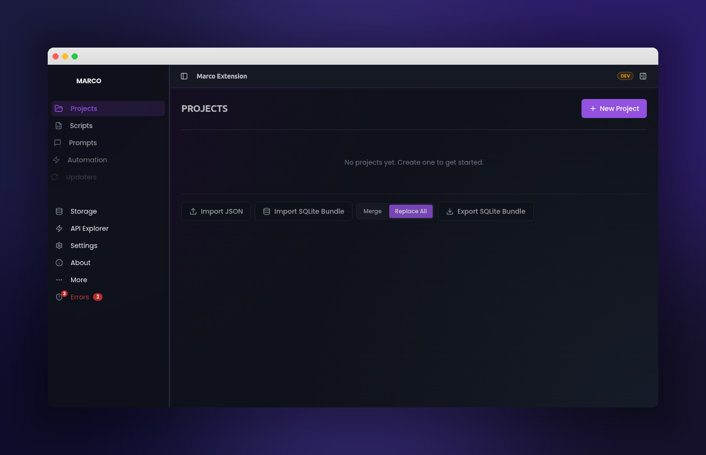

# Marco Chrome Extension

> **Browser automation for workspace management, credit monitoring, and AI-driven macro execution** — built as a Manifest V3 Chrome extension with a modular standalone script architecture.

<div align="center">

<!-- Build & Release -->
[](https://github.com/alimtvnetwork/macro-ahk-v21/actions/workflows/ci.yml)
[](https://github.com/alimtvnetwork/macro-ahk-v21/actions/workflows/release.yml)
[](https://github.com/alimtvnetwork/macro-ahk-v21/releases/latest)
[](https://github.com/alimtvnetwork/macro-ahk-v21/releases/latest)

<!-- Repo activity -->
[](https://github.com/alimtvnetwork/macro-ahk-v21/commits/main)
[](https://github.com/alimtvnetwork/macro-ahk-v21/pulse)
[](https://github.com/alimtvnetwork/macro-ahk-v21/issues)
[](https://github.com/alimtvnetwork/macro-ahk-v21)

<!-- Code-quality report cards (TS/JS analogues to Go Report Card) -->
[](https://www.codefactor.io/repository/github/alimtvnetwork/macro-ahk-v21)
[](https://app.codacy.com/gh/alimtvnetwork/macro-ahk-v21/dashboard)
[](https://codeclimate.com/github/alimtvnetwork/macro-ahk-v21/maintainability)

<!-- Stack & standards -->
[](https://developer.chrome.com/docs/extensions/mv3/intro/)
[](https://www.typescriptlang.org/)
[](https://nodejs.org/)
[](https://pnpm.io/)
[](https://vitejs.dev/)
[](./eslint.config.js)
[](https://vitest.dev/)
[](#license)

</div>

<p align="center">
  
</p>

> **Note on report cards** — TypeScript/Node has no exact equivalent of [Go Report Card](https://goreportcard.com/). The closest analogues are **CodeFactor** (auto-grades any GitHub repo, no signup required for the badge), **Codacy**, and **Code Climate Maintainability** — all wired up above. Replace `PROJECT_ID` in the Codacy badge with your project's UUID after activating the repo at [app.codacy.com](https://app.codacy.com/).

**Current Version:** v2.158.0 | **Macro Controller:** v7.41

---

## Quick Start

### One-Liner Install

**Windows (PowerShell):**

```powershell
irm https://raw.githubusercontent.com/alimtvnetwork/macro-ahk-v21/main/scripts/install.ps1 | iex
```

**Linux / macOS (Bash):**

```bash
curl -fsSL https://raw.githubusercontent.com/alimtvnetwork/macro-ahk-v21/main/scripts/install.sh | bash
```

### Pin a Specific Version

```powershell
# PowerShell
& { $Version = "v2.116.1"; irm https://raw.githubusercontent.com/alimtvnetwork/macro-ahk-v21/main/scripts/install.ps1 | iex }
```

```bash
# Bash
curl -fsSL https://raw.githubusercontent.com/alimtvnetwork/macro-ahk-v21/main/scripts/install.sh | bash -s -- --version v2.116.1
```

### Custom Directory Install

**Windows (PowerShell):**

```powershell
.\install.ps1 -InstallDir "D:\marco-extension"
```

**Linux / macOS:**

```bash
./install.sh --dir ~/marco-extension
```

### Installer Options

**Windows (PowerShell):**

| Flag | Description | Example |
|------|-------------|---------|
| `-Version` | Pin a specific release | `-Version v2.116.1` |
| `-InstallDir` | Custom install directory | `-InstallDir D:\marco-extension\v2.116.1` |
| `-Repo` | Override GitHub repository | `-Repo alimtvnetwork/macro-ahk-v21` |

**Linux / macOS (Bash):**

| Flag | Description | Example |
|------|-------------|---------|
| `--version` | Pin a specific release | `--version v2.116.1` |
| `--dir` | Custom install directory | `--dir ~/marco-extension/v2.116.1` |
| `--repo` | Override GitHub repository | `--repo alimtvnetwork/macro-ahk-v21` |

### Manual Install

1. Download `marco-extension-v{VERSION}.zip` from [Releases](https://github.com/alimtvnetwork/macro-ahk-v21/releases)
2. Extract to a folder (e.g., `D:\marco-extension\v2.116.1`)
3. Open `chrome://extensions` (or `edge://extensions`)
4. Enable **Developer mode** (toggle in top-right)
5. Click **Load unpacked** and select the extracted folder

Works in **Chrome**, **Edge**, **Brave**, **Arc**, and other Chromium browsers.

---

## Companion Repositories

Marco ships alongside an AutoHotkey sidecar that drives keyboard/mouse automation on Windows. Clone it next to this repo:

```bash
git clone https://github.com/alimtvnetwork/macro-ahk-v21 "macro-ahk"
```

Or use the package.json script:

```bash
pnpm clone:ahk
```

This creates a `macro-ahk/` folder containing the AHK v2 scripts that pair with the Chrome extension's macro controller.

See `docs/extension-architecture.md` §11 "Companion repositories" for integration details, version coupling, and required folder layout.

---

## What It Does

Marco is a Chrome extension that automates workspace management workflows through injectable scripts. It operates by injecting standalone JavaScript modules into web pages, controlled by a popup UI and a background service worker.

### Core Capabilities

| Feature | Description |
|---------|-------------|
| **Script Injection Engine** | Injects IIFE-compiled scripts into page context (MAIN world) with dependency resolution and load ordering |
| **Macro Controller** | Core automation controller — XPath utilities, auth panel, token resolution, UI overlays |
| **Credit Monitoring** | Real-time credit balance checking with workspace-level tracking and retry-on-refresh policy |
| **Workspace Management** | Automated workspace switching, transfer dialogs, and multi-workspace operations |
| **Loop Engine** | Configurable automation loops with delay, retry, and condition-based stopping |
| **AI Prompt System** | Dual-cache prompt management with IndexedDB storage, manual-load model, and normalization |
| **Auth Bridge** | Zero-network JWT resolution waterfall with 2-step recovery and token caching |
| **Session Logging** | Dual-layer logging to SQLite + Origin Private File System with diagnostics export |
| **Self-Healing Storage** | Two-stage builtin script guard that detects and repairs corrupted script storage |
| **Build-Aware Cache** | Injection cache invalidation tied to build version, preventing runtime drift |

### Script Architecture

The extension uses a **declarative, instruction-driven** architecture. Each standalone script defines its own `instruction.ts` manifest that declares:

- Script metadata (name, version, description)
- Dependencies and load order
- CSS, templates, and configuration files
- Injection world (MAIN or ISOLATED)

Scripts are compiled to **IIFE bundles** (no module imports at runtime) and injected in dependency order: CSS → configs → templates → JS.

### Default Scripts

| Script | Purpose | Default |
|--------|---------|---------|
| **Marco SDK** | Shared SDK providing `require()`, messaging, and utility functions | Always loaded |
| **XPath** | XPath query utilities for DOM element selection | Enabled |
| **Macro Controller** | Core controller — auth, UI, credit checking, workspace automation | Enabled |

---

## Features In Detail

### Popup UI

The popup provides real-time control over script injection and diagnostics:

| Control | What It Does |
|---------|--------------|
| **Run** | Clears DOM markers, injects all enabled scripts from the active project |
| **Toggle** | Enables/disables the active project (persists across sessions) |
| **Per-Script Toggle** | Enable/disable individual scripts — state persists across restarts |
| **Re-inject** | Clears existing injections, re-injects all enabled scripts fresh |
| **Logs** | Copies session logs + errors as JSON to clipboard |
| **Export** | Downloads ZIP with logs, errors, and SQLite database |
| **Auth Diagnostics** | Real-time token status with contextual help tooltips |

### Options Page

Full-featured settings UI with:

- Hash-based deep linking (e.g., `#activity`)
- Direction-aware slide-and-fade view transitions
- Activity log viewer with filtering
- Script configuration management
- Advanced automation (chains & scheduling)

### Injection Diagnostics

Granular visual feedback per script:

| Badge | Meaning |
|-------|---------|
| Disabled | Script toggled off by user |
| Missing | Script file not found in storage |
| Injected | Successfully injected into page |
| Failed | Injection error (check debug panel) |

### Authentication

- **Zero-network resolution** — JWTs resolved from local storage waterfall before any network calls
- **2-step recovery** — Auth Bridge attempts cached token, then page extraction
- **Extension context invalidation** — Detected and explained via help tooltips when extension reloads

### Logging & Export

- **SQLite persistence** — Unlimited storage with structured queries
- **OPFS fallback** — Origin Private File System for crash-resilient writes
- **Diagnostics ZIP** — Human-readable `logs.txt` + raw data for debugging
- **Error synchronization** — Error counts broadcast across extension contexts in real-time

---

## Architecture

### Extension Lifecycle (6 Phases)

```
1. Install + Bootstrap     → Manifest loading, SQLite init
2. Seeding                 → seed-manifest.json → chrome.storage.local
3. Script Pre-caching      → Parallelized fetch of all script files
4. Injection               → Dependency resolution → CSS → configs → templates → JS
5. Runtime                 → Auth bridge, credit monitoring, loop engine
6. Export / Cleanup        → Diagnostics ZIP, session teardown
```

### Message Relay (3-Tier)

```
Page Scripts (MAIN world)
    ↕ window.postMessage
Content Scripts (ISOLATED world)
    ↕ chrome.runtime.sendMessage
Background Service Worker
    ↕ chrome.storage.local
Popup / Options UI
```

### Storage Layers

| Layer | Capacity | Purpose |
|-------|----------|---------|
| SQLite (Extension) | Unlimited | Persistent logs, diagnostics |
| chrome.storage.local | 10 MB | Script metadata, settings, state |
| IndexedDB | Unlimited | Prompt cache (dual JSON/text) |
| OPFS | Unlimited | Crash-resilient log writes |

### Performance Optimizations

- **DomCache** with TTL for repeated DOM queries
- **Merged MutationObservers** — single observer, multiple handlers
- **API call deduplication** via `CreditAsyncState`
- **Dirty-flag UI updates** — `updateUILight()` skips unchanged elements
- **Batched localStorage writes** via `LogFlushState`

---

## Build Pipeline

### Prerequisites

- **Node.js** 20+
- **pnpm** 9+

### Development

```bash
pnpm install
pnpm run dev
```

Load `chrome-extension/dist/` as an unpacked extension in Developer mode.

### Production Build (Full Pipeline)

```bash
pnpm run build:sdk              # 1. Marco SDK (IIFE)
pnpm run build:xpath            # 2. XPath utility
pnpm run build:macro-controller # 3. Macro Controller (includes LESS, templates, prompts)
pnpm run build:extension        # 4. Chrome extension (copies all artifacts)
```

### Build Commands

| Command | What It Does |
|---------|-------------|
| `pnpm run build:sdk` | Compile Marco SDK → IIFE bundle + `.d.ts` |
| `pnpm run build:xpath` | Compile XPath utility → IIFE bundle |
| `pnpm run build:macro-controller` | Compile Macro Controller → IIFE + CSS + templates + prompts |
| `pnpm run build:extension` | Build Chrome extension (validates + copies all standalone scripts) |
| `pnpm run build:prompts` | Aggregate prompt `.md` files → `macro-prompts.json` |
| `pnpm run build:macro-less` | Compile LESS → CSS |
| `pnpm run build:macro-templates` | Compile HTML templates → `templates.json` |
| `pnpm run test` | Run test suite (Vitest) |
| `pnpm run lint` | ESLint with SonarJS (zero warnings enforced) |

### Build via PowerShell (Windows)

```powershell
.\run.ps1 -d     # Full deploy pipeline: build all + deploy to Chrome profile
.\run.ps1         # Production build (no source maps)
```

The `run.ps1` orchestrator is modular — 8 dot-sourced modules in `build/ps-modules/`:

| Module | Purpose |
|--------|---------|
| `utils.ps1` | Version parsing, pnpm helpers |
| `preflight.ps1` | Dynamic import/require scanning |
| `standalone-build.ps1` | Parallel standalone builds via `Start-Job` |
| `extension-build.ps1` | Extension build + manifest validation |
| `browser.ps1` | Profile detection, extension deployment |
| `watch.ps1` | FileSystemWatcher with debounce |

### Extension dist Layout

```
chrome-extension/dist/
├── projects/
│   ├── scripts/
│   │   ├── marco-sdk/
│   │   │   ├── marco-sdk.js
│   │   │   └── instruction.json
│   │   ├── xpath/
│   │   │   ├── xpath.js
│   │   │   └── instruction.json
│   │   └── macro-controller/
│   │       ├── macro-looping.js
│   │       ├── macro-looping.css
│   │       ├── macro-looping-config.json
│   │       ├── macro-theme.json
│   │       ├── templates.json
│   │       └── instruction.json
│   └── seed-manifest.json
├── prompts/
│   └── macro-prompts.json
├── readme.md
├── VERSION
└── ...
```

---

## Adding a New Script

1. Create `standalone-scripts/{name}/src/index.ts` and `src/instruction.ts`
2. Add `build:{name}` script in root `package.json`
3. Add TypeScript config (`tsconfig.{name}.json`)
4. Add Vite config (`vite.config.{name}.ts`)
5. The build pipeline auto-discovers and deploys it

The `instruction.ts` is the **sole manifest** — no separate configuration files needed. It declares script metadata, dependencies, files, and injection behavior in a single TypeScript file that compiles to `instruction.json`.

### Dynamic Script Loading

At runtime, scripts can load other scripts dynamically:

```typescript
await RiseupAsiaMacroExt.require("Project.Script");
```

---

## CI/CD Release Pipeline

Pushing to a `release/*` branch (e.g., `release/v2.117.0`) automatically:

1. Installs dependencies with pnpm; if `pnpm-lock.yaml` is absent it falls back to `pnpm install --no-frozen-lockfile --lockfile=false`
2. Runs root ESLint and `chrome-extension` ESLint
3. Runs the full test suite
4. Builds standalone scripts (SDK → XPath → Macro Controller)
5. Builds the Chrome extension
6. Copies `readme.md`, `VERSION`, and `changelog.md` into the release asset set
7. Zips `chrome-extension/dist/` into `marco-extension-v{VERSION}.zip`
8. Generates categorized release notes from commit history with Bash + PowerShell install commands
9. Creates a GitHub Release with all assets attached

**No email or notification is sent** — check the [Releases page](https://github.com/alimtvnetwork/macro-ahk-v21/releases) for status.

### Release Assets

| Asset | Description |
|-------|-------------|
| `marco-extension-v{VER}.zip` | Chrome extension — load unpacked in `chrome://extensions` |
| `macro-controller-v{VER}.zip` | Standalone macro controller scripts |
| `marco-sdk-v{VER}.zip` | Marco SDK |
| `xpath-v{VER}.zip` | XPath utility scripts |
| `install.ps1` | PowerShell installer (Windows) |
| `install.sh` | Bash installer (Linux/macOS) |
| `VERSION.txt` | Version identifier |
| `changelog.md` | Full project changelog |

### Release Install Commands

**Windows (PowerShell)**

```powershell
irm https://github.com/alimtvnetwork/macro-ahk-v21/releases/download/v{VER}/install.ps1 | iex
```

**Linux / macOS**

```bash
curl -fsSL https://github.com/alimtvnetwork/macro-ahk-v21/releases/download/v{VER}/install.sh | bash
```

---

## Project Structure

```
├── chrome-extension/           # Chrome extension source + dist
│   ├── src/
│   │   ├── background/        # Service worker, seeder, injection diagnostics
│   │   ├── content-scripts/    # Content script injection pipeline
│   │   ├── components/         # React popup + options UI (shadcn/ui)
│   │   └── lib/                # Platform adapter, auth bridge, utilities
│   └── dist/                   # Built extension (load unpacked from here)
├── standalone-scripts/         # Injectable standalone modules
│   ├── marco-sdk/              # Shared SDK (require, messaging, utilities)
│   ├── xpath/                  # XPath query utilities
│   ├── macro-controller/       # Core automation controller
│   │   ├── src/                # TypeScript source (class-based modules)
│   │   ├── less/               # LESS stylesheets → CSS
│   │   ├── templates/          # HTML templates → templates.json
│   │   └── dist/               # Compiled IIFE + assets
│   └── prompts/                # AI prompt markdown files
├── scripts/                    # Build helpers & install scripts
│   ├── install.ps1             # Windows installer
│   ├── install.sh              # Linux/macOS installer
│   ├── compile-instruction.mjs # instruction.ts → instruction.json
│   ├── aggregate-prompts.mjs   # Prompt .md → macro-prompts.json
│   └── check-version-sync.mjs  # Version consistency validation
├── build/
│   └── ps-modules/             # PowerShell build modules (8 files)
├── spec/                       # Specifications & developer guides
├── tests/                      # Unit + E2E test suites
├── .github/workflows/          # CI/CD pipelines
│   └── release.yml             # Automated release on release/* push
└── .lovable/memory/            # AI development memory & context
```

### Tech Stack

| Layer | Technology |
|-------|-----------|
| **Extension UI** | React 18, TypeScript 5, Tailwind CSS v3, shadcn/ui |
| **Build System** | Vite 5, LESS, PowerShell (Windows orchestration) |
| **Standalone Scripts** | TypeScript → IIFE bundles (ES2020 target) |
| **Storage** | SQLite (sql.js), IndexedDB, chrome.storage.local, OPFS |
| **Testing** | Vitest, Playwright (E2E) |
| **Linting** | ESLint + SonarJS (zero warnings enforced) |
| **CI/CD** | GitHub Actions |

---

## Engineering Standards

The project enforces strict engineering standards (26 rules documented in `spec/06-coding-guidelines/engineering-standards.md`):

- **Zero ESLint warnings/errors** — SonarJS plugin enforced across all code
- **All errors include exact file path, missing item, and reasoning** — optimized for AI-assisted diagnosis
- **Unified versioning** — manifest, `constants.ts`, and standalone scripts always in sync
- **ASCII-safe console output** — no Unicode symbols in build output
- **Dark-only theme** — no light mode, no toggle
- **Constant naming convention** — `ID_`, `SEL_`, `CLS_`, `MSG_` prefixes in SCREAMING_SNAKE_CASE

---

## Author

<div align="center">

### [Md. Alim Ul Karim](https://www.google.com/search?q=alim+ul+karim)

**[Creator & Lead Architect](https://alimkarim.com)** | [Chief Software Engineer](https://www.google.com/search?q=alim+ul+karim), [Riseup Asia LLC](https://riseup-asia.com)

</div>

A system architect with **20+ years** of professional software engineering experience across enterprise, fintech, and distributed systems. His technology stack spans **.NET/C# (18+ years)**, **JavaScript (10+ years)**, **TypeScript (6+ years)**, and **Golang (4+ years)**.

Recognized as a **top 1% talent at Crossover** and one of the top software architects globally. He is also the **Chief Software Engineer of [Riseup Asia LLC](https://riseup-asia.com/)** and maintains an active presence on **[Stack Overflow](https://stackoverflow.com/users/361646/alim-ul-karim)** (2,452+ reputation, member since 2010) and **LinkedIn** (12,500+ followers).

|  |  |
|---|---|
| **Website** | [alimkarim.com](https://alimkarim.com/) · [my.alimkarim.com](https://my.alimkarim.com/) |
| **LinkedIn** | [linkedin.com/in/alimkarim](https://linkedin.com/in/alimkarim) |
| **Stack Overflow** | [stackoverflow.com/users/361646/alim-ul-karim](https://stackoverflow.com/users/361646/alim-ul-karim) |
| **Google** | [Alim Ul Karim](https://www.google.com/search?q=Alim+Ul+Karim) |
| **Role** | Chief Software Engineer, [Riseup Asia LLC](https://riseup-asia.com) |

### Riseup Asia LLC

[Top Leading Software Company in WY (2026)](https://riseup-asia.com)

|  |  |
|---|---|
| **Website** | [riseup-asia.com](https://riseup-asia.com/) |
| **Facebook** | [riseupasia.talent](https://www.facebook.com/riseupasia.talent/) |
| **LinkedIn** | [Riseup Asia](https://www.linkedin.com/company/105304484/) |
| **YouTube** | [@riseup-asia](https://www.youtube.com/@riseup-asia) |

---

## License

This project is proprietary software owned by Riseup Asia LLC. All rights reserved.
